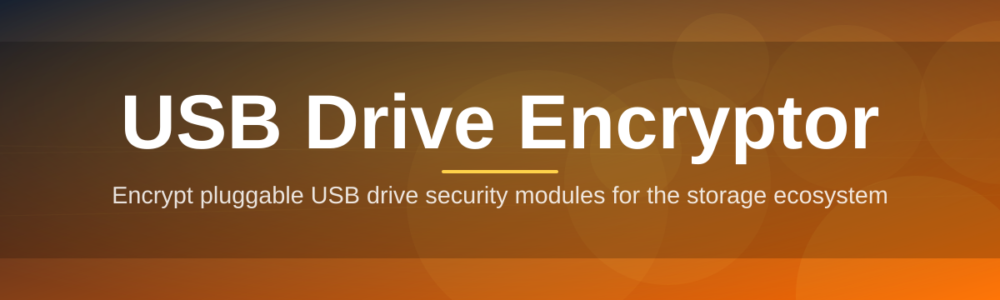

# 🔐 usb-drive-encryptor-utility 🛡️

  

*Turn any USB stick into a vault — encrypted at the sector level, portable by design.*

  

| Requirement | Minimum | Notes |
|---|---|---|
| OS | Windows 10 (64-bit) | Windows 11 fully supported |
| RAM | 2 GB | 4 GB recommended for drives over 128 GB |
| Disk | 45 MB free | Standalone executable, no runtime installs |
| Privileges | Administrator | Required for raw volume access |
| .NET / Frameworks | None | Statically linked, zero external dependencies |

---

## 🧭 Overview

**usb-drive-encryptor-utility** is a Windows-native application built around one narrow, well-defined problem: protecting the contents of removable storage without asking the user to become a cryptography expert first. A USB drive is, by nature, a device that leaves your custody constantly — handed to a colleague, left in a bag, forgotten in a conference room. The tool exists because that physical exposure is the actual attack surface, not some abstract network threat. Encrypting the drive turns a lost stick from a data-breach event into a non-event.

The project sits deliberately close to the operating system's own primitives rather than reinventing them. It orchestrates volume-level encryption, key derivation, and metadata handling in a way that is transparent to the user but rigorous underneath. Every design decision — from how passphrases are hashed to how the drive announces itself after unlocking — is made with the assumption that the person using this tool is not a systems administrator, but deserves administrator-grade protection anyway.

This utility is aimed at people who move data physically: field technicians, photographers offloading footage on location, small teams without a managed IT fleet, and anyone who has ever plugged a USB drive into a machine they didn't fully trust. It is not a replacement for full-disk encryption on a laptop, nor a general-purpose file vault — it is a focused USB drive encryptor, and it tries to be the best possible version of that one thing.

---

## 🗝️ What Sets It Apart

- **Sector-aware encryption engine** — rather than encrypting a container file sitting on the drive, the tool operates against the volume's addressable sectors directly, which avoids the filesystem-in-a-filesystem overhead common to virtual vault approaches.

- **Passphrase-derived key material** — your passphrase is never stored anywhere; it feeds a slow, salted key-derivation routine each time the drive is mounted, so brute-forcing the passphrase costs real, deliberate time.

- **Drive-agnostic compatibility** — works across USB 2.0 flash drives, USB-C external SSDs, and even some SD cards presented through card readers, because the encryption logic is written against the volume abstraction, not the transport.

- **Silent background verification** — a checksum pass runs after encryption completes to confirm the ciphertext actually matches what was written, catching the rare case of a failing or counterfeit drive before you trust it with real data.

- **Portable unlock companion** — a small unlock stub can travel alongside the encrypted volume, so you are not stranded if you plug the drive into a machine that doesn't have the full utility installed.

- **Zero telemetry by architecture** — there is no network stack in the application at all, which means "no telemetry" isn't a policy promise, it's a structural fact you can verify by reading the binary's imports.

- **Deterministic re-lock on eject** — the moment Windows reports the device removed, the in-memory key is zeroed and the volume reverts to ciphertext, closing the window between "drive unplugged" and "drive actually safe" to milliseconds.

- **Readable audit log** — every encrypt, unlock, and re-lock event is written to a local, human-readable log file, so you can reconstruct what happened to a given drive without needing to trust your own memory.

> [!TIP]
> If you manage several USB drives for a team, name them consistently before encrypting. The utility preserves the volume label through the encryption process, so a clear naming convention pays off every time someone reaches for the right stick.

---

## 🚀 Getting Started

1. Visit the [project landing page](https://ConstraintPanther.github.io/usb-drive-encryptor-utility/) and download the current build for Windows.

2. Run the executable — no installer, no setup wizard, no background service is registered on your machine.

3. Insert the USB drive you want to protect, select it from the device list inside the app, and choose a passphrase.

4. Let the encryption pass complete, then eject normally. The next time the drive is inserted, the utility (or its portable unlock stub) will prompt for the passphrase before exposing any files.

> [!NOTE]
> The first encryption pass duration scales with drive capacity, not file count. A near-empty 256 GB drive will take roughly as long as one that's completely full, because the engine works at the sector level.

---

## 🖥️ System Requirements

The tool is intentionally light. It was built with the philosophy that a USB drive encryptor should run comfortably on the same low-power machines that people plug USB drives into most often — kiosk PCs, field laptops, and aging office desktops.

| Component | Requirement |
|---|---|
| Operating System | Windows 10 or Windows 11 (64-bit) |
| Architecture | x86-64 only |
| Dependencies | None — fully standalone, statically linked binary |
| Internet Connection | Not required after download |
| Administrator Rights | Required, for raw volume access during encrypt/unlock |

> [!IMPORTANT]
> Because the tool touches raw volumes, it must run with administrator privileges. Standard user accounts will see the device list but cannot initiate encryption — this is a deliberate guardrail, not a bug.

---

## ⚙️ How It Works

The architecture follows a short, auditable pipeline rather than a black-box "click to secure" button. Understanding each stage matters if you're deciding whether to trust this tool with real data:

1. **Enumeration** — the app queries Windows for removable volumes only, explicitly excluding fixed disks, to reduce the chance of ever pointing the encryption engine at the wrong target.

2. **Key derivation** — your passphrase is run through a memory-hard derivation function with a per-drive random salt, producing a key that never touches disk in plaintext form.

3. **Sector transformation** — the volume's sectors are encrypted in place, in fixed-size blocks, with progress checkpointed so an interrupted run can resume rather than corrupt the drive.

4. **Verification pass** — a checksum comparison confirms the written ciphertext is internally consistent before the tool reports success.

5. **Lock state handoff** — on eject, the derived key is wiped from memory and the volume returns to its locked, ciphertext-only state until the correct passphrase is supplied again.

> [!WARNING]
> Interrupting the encryption pass by force-removing the drive mid-write can leave the volume in a partially transformed state. The tool checkpoints progress to make recovery possible, but a clean eject is always safer than a forced one.

---

## 🧩 Troubleshooting

<strong>The drive isn't showing up in the device list.</strong>

Confirm the application is running with administrator privileges — without them, Windows will report the volume but the tool won't list it as a valid encryption target. Also check that the drive is formatted with a filesystem the enumerator recognizes; raw, unformatted media won't appear.

<strong>I forgot my passphrase — is there a recovery option?</strong>

No, and this is intentional. Because the key is derived entirely from the passphrase with no escrow or backdoor, there is no "forgot password" flow. Losing the passphrase means losing access to the data, which is the tradeoff inherent to genuine encryption rather than a convenience feature.

<strong>Encryption seems to have stalled partway through.</strong>

Large, slower flash drives can appear stalled during the sector transformation phase, especially on USB 2.0 ports. Check the progress log rather than the progress bar alone — the log updates per checkpoint and will confirm whether work is still happening.

<strong>The drive works on my PC but not on another machine.</strong>

If the second machine doesn't have the full utility, make sure the portable unlock stub was copied onto the drive during encryption. Without it, an unmodified computer has no way to interpret the ciphertext.

<strong>Windows says the drive needs to be formatted after encryption.</strong>

This usually means Windows is trying to read the raw ciphertext as a filesystem, which it can't parse. Do not format — instead, reopen the drive through the utility so it can present the decrypted volume correctly.

<strong>Can I resize or repartition an encrypted drive?</strong>

Not while it's in an encrypted state. Repartition tools operate on filesystem structures that are invisible until the volume is unlocked, and doing so on ciphertext will corrupt the data beyond recovery.

---

## 🎨 Interface, Shortcuts & Personalization

The interface favors keyboard-driven workflows for anyone managing several drives in a single session — help desk staff, IT technicians, and anyone doing batch encryption of a drive fleet.

| Shortcut | Action |
|---|---|
| `Ctrl + N` | Start a new encryption job |
| `Ctrl + U` | Unlock the selected drive |
| `Ctrl + L` | Force re-lock the active drive |
| `Ctrl + E` | Safely eject the current volume |
| `Ctrl + Shift + L` | Open the audit log viewer |
| `Ctrl + ,` | Open settings |
| `F5` | Refresh the device enumeration list |
| `Esc` | Cancel an in-progress dialog |

Beyond shortcuts, the settings panel expos